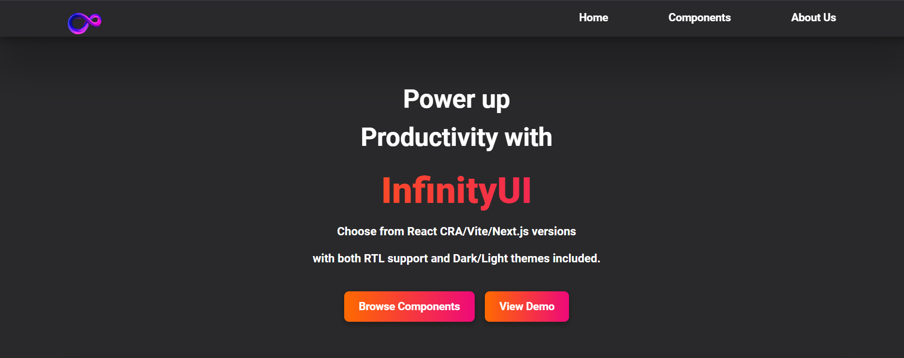
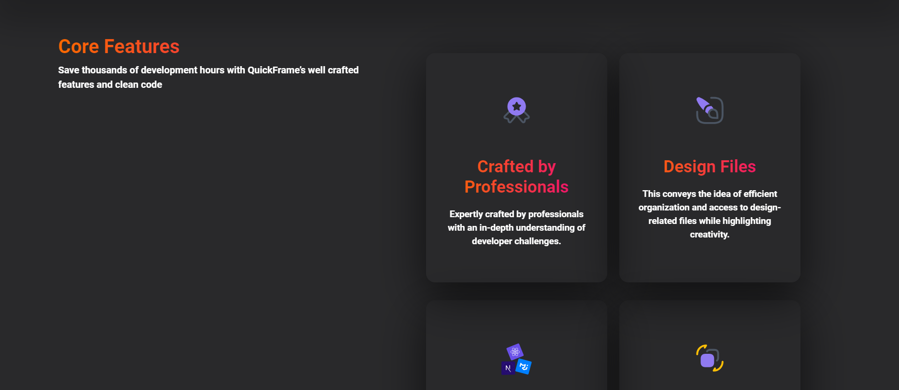
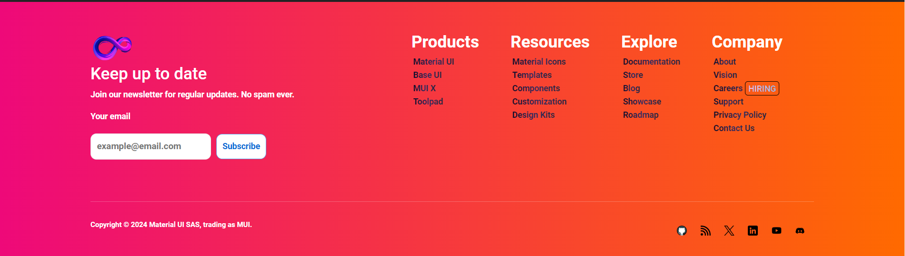
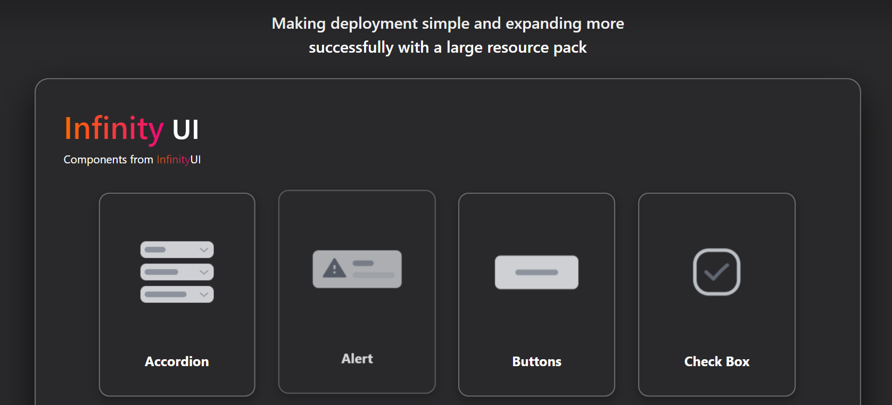
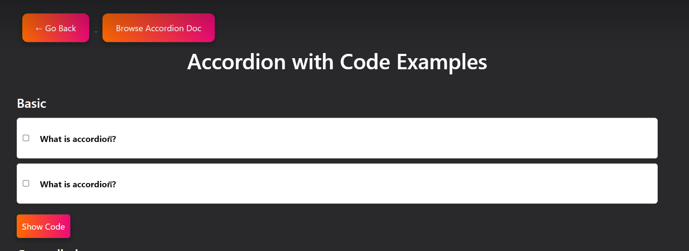

# Project Title  

Infinity UI

## Introduction
Our project is a UI library website designed to display different web components that can be reused in various projects. The website includes a home page, a navigation bar, a footer, and 8 different components. We built everything using HTML and CSS.

The purpose of this project is to provide a collection of ready-made UI elements that developers can use to quickly design websites. It helps solve the problem of creating common components from scratch, saving time and ensuring a consistent design across pages. The library is simple to use and fully responsive, so it works on all device sizes.

## Project Type
Frontend

## Deplolyed App
Frontend: https://keen-granita-68a4ab.netlify.app/

## Directory Structure
my-app/
├─
├─ frontend / GPT-Gardians-009
│  ├─ index.html
   ├─accordion.html
   ├─├─accordion.css
   ├─alert.html
   ├─alert.css
   ├─button.html
   ├─button.css
   ├─checkcox.html
   ├─checkbox.css
   ├─components.html
   ├─components.css
   ├─home.css
   ├─list.html
   ├─list.css
   ├─nav.css
   ├─navbarcomponent.html
   ├─radio.html
   ├─radio.css
   ├─spinner.html
   

## Video Walkthrough of the project

https://drive.google.com/file/d/18he89JLxBs-UosHyS_u-WfjfRDrmkOPL/view?usp=drive_link

## Video Walkthrough of the codebase

https://drive.google.com/file/d/1T2Qtrbh7hpdZdIx6LKxlbNJdd7L1zz-s/view?usp=drive_link

## Features
List out the key features of our application.

Feature 1: Reusable Components
Feature 2: Responsive Design
Feature 3: Simple Navigation
Feature 4: Consistent Layout
Feature 5: Show Code Feature
Feature 6: Clean and Minimal Design

## design decisions or assumptions
List our design desissions & assumptions

Design Decisions:

Simple and Minimalist Layout:
We decided to keep the layout clean and simple to ensure that the components are the main focus and can be easily understood by users.

HTML and CSS Only:
We chose to use only HTML and CSS for the project to keep it lightweight and easily customizable without relying on advanced JavaScript or frameworks.

Component Consistency:
We ensured that all components follow a consistent design pattern, with similar spacing, fonts, and colors, making the library easy to use in various projects.

Responsive Design:
We prioritized responsiveness in our design so that the components automatically adjust based on the screen size, ensuring usability on all devices.

Code Visibility:A “Show Code” button was included to make it easy for users to see the underlying HTML and CSS of each component, encouraging them to copy and use the code.

Assumptions:
Developers Are the Target Audience:
We assumed that the primary users of this library would be web developers who are familiar with HTML and CSS.

Modern Browsers:
We assumed that users will access the website on modern browsers that support standard HTML5 and CSS3 features.

Customization:
We assumed that developers would likely want to customize the components, so we kept the design simple and modular for easy modification.

Basic Knowledge of Frontend:
We assumed users have a basic understanding of frontend development and can modify the components to suit their needs.

## Installation & Getting started

1:open terminal in vs code
Enter:  git clone https://github.com/ShivamGurjar07/GPT-Guardians_009.git

2: cd./GPT-Guardians_009

3: open home with live server

## Usage

1: cd./GPT-Guardians_009

2: open home with live server

3: Screenshots

## Technology Stack
List of the technologies used in the project.

- HTML
- CSS
- Basic Javascript